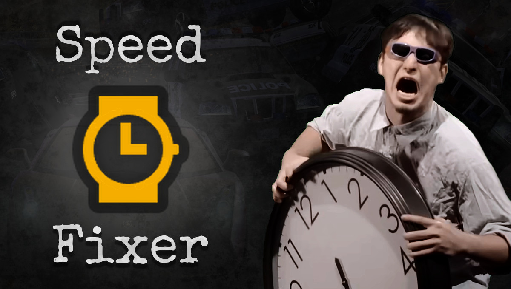

SpeedFixer lets you **customise the Speedbreaker mechanic** in *Need for Speed: Most Wanted* (2005):
* the car speed required to activate it,
* whether it has a limited active duration,
* its maximum active duration when fully charged,
* whether you can recharge it passively over time,
* the car speed required to trigger passive recharging,
* how long fully passive recharging takes to complete,
* how effective active recharging (by drifting) is,
* the drifting speed required to trigger active recharging,
* the slip angle required to trigger active recharging,
* the dilation multiplier for in-game time,
* the car-mass multiplier for collisions,
* the time-dilation transition speed,
* the gravity multiplier for downforce,
* the boost to front-wheel steering friction,
* the maximum front-wheel steering angle,
* the reduction of aerodynamic drag, and
* the reduction of steering drag.

&nbsp;

The **sections below** address these questions in detail:
1. [How do I install SpeedFixer for my game?](#1---how-do-i-install-speedfixer-for-my-game)
2. [Which mods are (in)compatible with SpeedFixer?](#2---which-mods-are-incompatible-with-speedfixer)
3. [How may I share or bundle SpeedFixer?](#3---how-may-i-share-or-bundle-speedfixer)

&nbsp;

&nbsp;

&nbsp;

# 1 - How do I install SpeedFixer for my game?

**Before installing** SpeedFixer:
1. read and understand the section about [mod (in)compatibilities](#2---which-mods-are-incompatible-with-speedfixer) below,
2. make sure your cracked copy of the game isn't a repack or came pre-modified in any way,
3. make sure your game's `speed.exe` is compatible (i.e. 5.75 MB / 6,029,312 bytes large), and
4. install an `.asi` loader or any mod with one (e.g. the [WideScreenFix](https://github.com/ThirteenAG/WidescreenFixesPack/releases/tag/nfsmw) mod by ThirteenAG).

&nbsp;

**To install** SpeedFixer:
1. download and extract the [`NfSMW_SpeedFixer_v1.04.1.7z`](https://github.com/rng-guy/NFSMWSpeedFixer/releases/latest) archive;
2. copy SpeedFixer's `scripts` folder to your game's folder, replacing existing files; and
3. if SpeedFixer's `.asi` file gets flagged by your antivirus software, whitelist the file.

&nbsp;

**After installing** SpeedFixer, edit its `NFSMWSpeedFixerSettings.ini` file to your liking.

**To uninstall** SpeedFixer, remove its files from your game's `scripts` folder.

**To update** SpeedFixer, uninstall it and repeat the installation process above. If you update from a version older than v1.04.00, replace the old configuration file.

&nbsp;

&nbsp;

&nbsp;

# 2 - Which mods are (in)compatible with SpeedFixer?

All **[VltEd](https://nfs-tools.blogspot.com/2019/02/nfs-vlted-v46-released.html) and [Binary](https://github.com/SpeedReflect/Binary/releases) mods** should be fully compatible with all SpeedFixer configurations. 

Almost all  **other `.asi` mods** should be fully compatible with all SpeedFixer configurations. If you use the [NFSMW ExtraOptions](https://github.com/ExOptsTeam/NFSMWExOpts/releases) mod by ExOptsTeam, SpeedFixer overrides all its Speedbreaker features.

&nbsp;

&nbsp;

&nbsp;

# 3 - How may I share or bundle SpeedFixer?

You are free to bundle SpeedFixer and its files with your own mod, **no credit required**. In the interest of code transparency, however, consider linking to [SpeedFixer's GitHub repository](https://github.com/rng-guy/NFSMWSpeedFixer) somewhere in your mod's documentation (e.g. README).